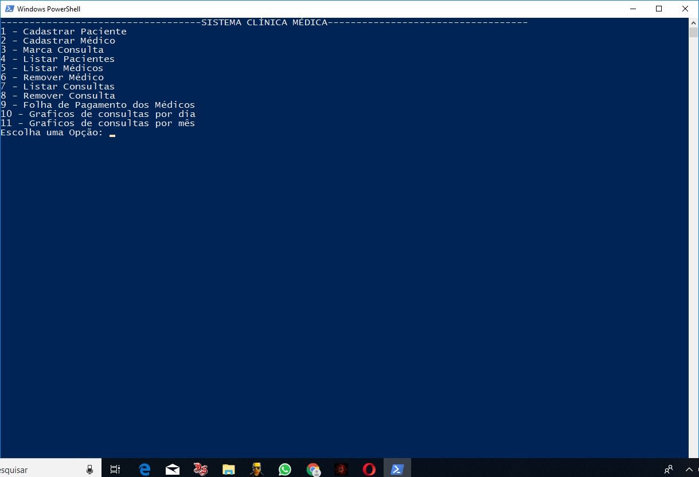
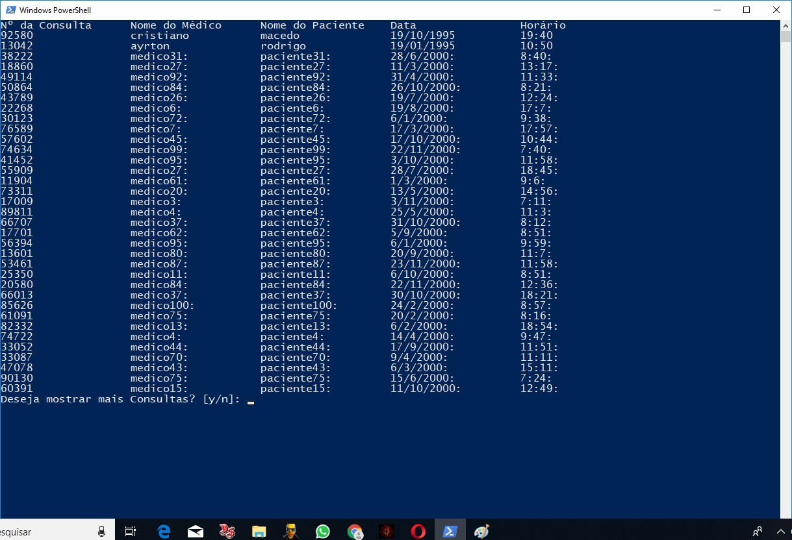
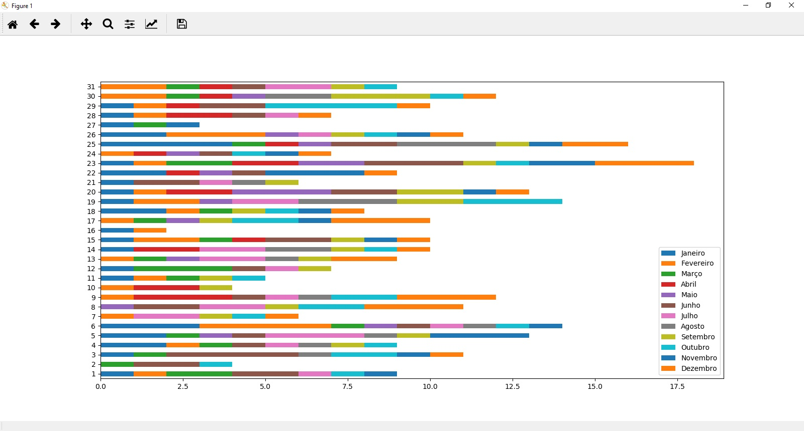
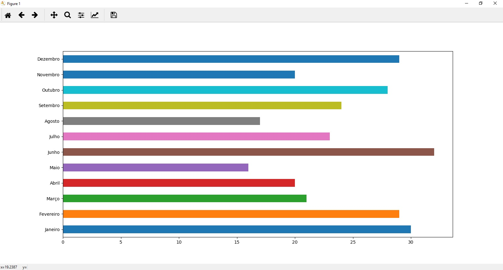

# Sistema_Clinica_Medica
Sistema criado para disciplina de laboratório de programação do curso de ciências da computação da universidade Tiradentes 

# Especificações do sistema
O sistema foi criado com intuito de praticar o uso de bibliotecas tais como pickle e pandas
O sistema foi desenvolvido em python utilizando o paradigma de programação estruturada

# Alunos envolvidos no sistema
- Cristiano Macedo Guimarães de Oliveira
- Carlos Alberto Mendonça Vasconcelos

# Objetivo do Projeto
O objetivo do projeto é praticar o manuseio de novas bibliotecas apresentadas na disciplina 

# Bibliotecas utilizadas
- Pandas
- NumPy
- Matplotlib
- Os 
- time
- Random
- Pickle

# Funções que o sistema possui

- Cadastro de paciente (nome, email, telefone, rg, cpf, endereço, numero, bairro, cidade, uf, plano de saúde)
- Cadastro de médico (nome, email, telefone, celular, crm, rg, cpf, especialização,endereço, numero, bairro, cidade, uf, plano de saúde)
- Marcar consulta(medico, paciente, data, hora)
- Listar pacientes
- Listar Médicos
- Remover médico
- Listar consulta
- Remover consulta
- Folha de pagamento médico
- Gerar gráficos de consultas por dia e por mês
- O sistema deve persistir os dados (ou seja, salvar em arquivo e permitir abrir o arquivo)

# Persistência dos dados
Os dados foram salvos usando a biblioteca pickle 
onde cada tipo de dado (Pacientes, Médicos, Consultas) foi separado em 1 arquivo.pickle

# Organização dos arquivos.py

- Cada arquivo.py presente no sistema foi separado para armazena as funções com ações semelhantes
- Funções de carregar e salva dados foram escritas no arquivo load_save.py
- Funções de cadastro e remoção foram escritas no arquivo register_remove.py
- Funções de validação foram escritas no arquivo validate.py
- Funções para imprimir lista dos dados foram escritas no arquivo printAll.py
- Funções para gerar graficos foram escritas no arquivo graphcs.py
- Funções que lidam com Ids foram escritas no arquivo generateId.py
- Funções que lidam com a folha de pagamento foram escritas no arquivo payRoll.py

# Screenshots do Sistema

